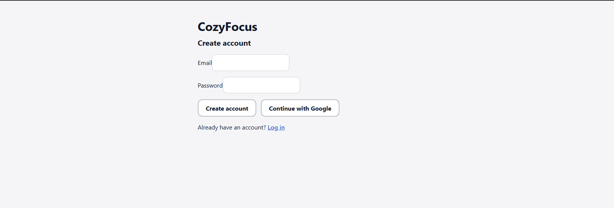
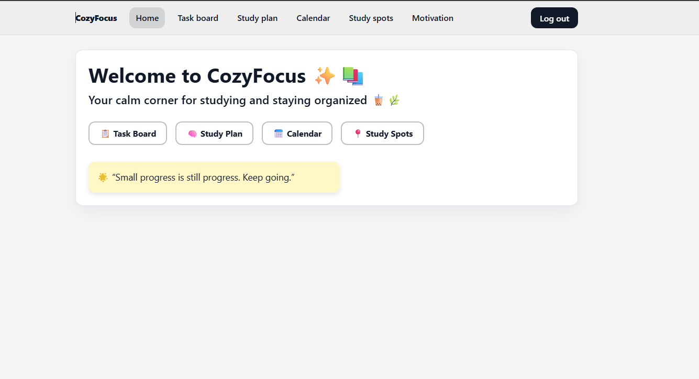
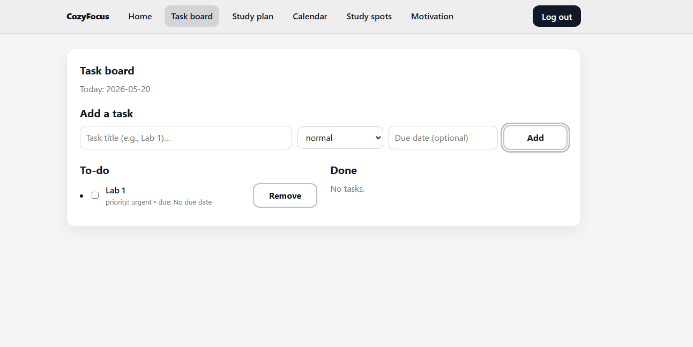
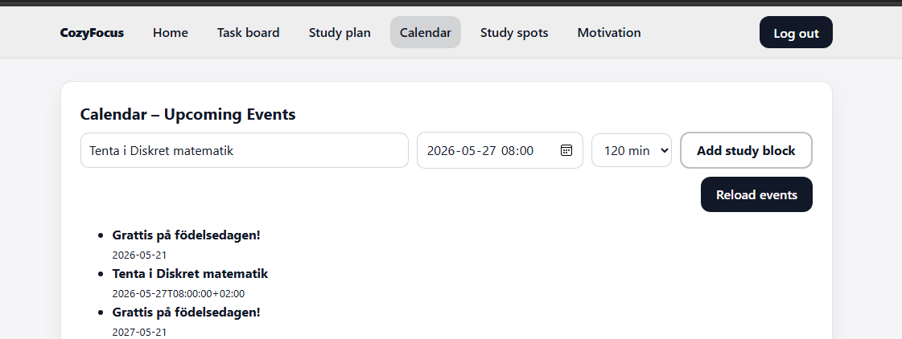
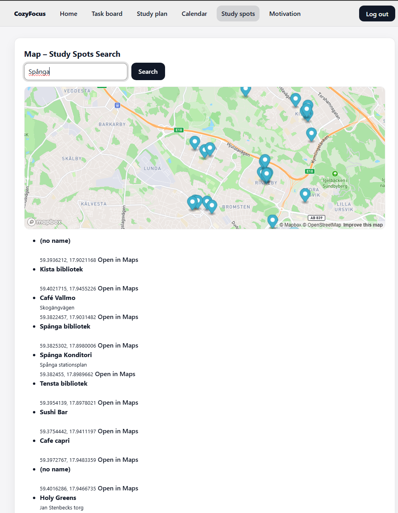
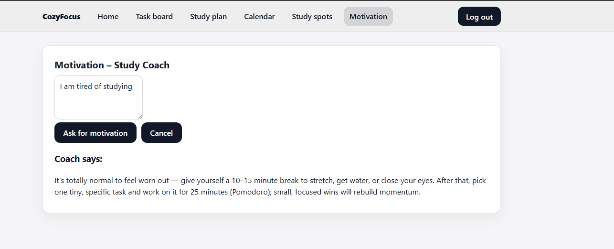

Rita Daloul – E-portfolio

Civilingenjörsstudent i informationsteknik på KTH med intresse för frontend-utveckling och moderna webbapplikationer.

---

Kontakt:
Email: ritadaloul2004.d@gmail.com
LinkedIn: [https://www.linkedin.com/in/rita-daloul-5152722b3](https://www.linkedin.com/in/rita-daloul-5152722b3/)    

---

Projekt

CozyFocus – Studieplaneringswebb

CozyFocus är en webbaserad studie- och produktivitetsapp utvecklad i React. Projektet skapades för att hjälpa studenter att planera uppgifter, strukturera veckan och samla flera studieverktyg i ett gränssnitt.
Projektet genomfördes inom kursen Interaction Programming and the Dynamic Web.

Funktioner
- Uppgiftshantering med prioritering
- Veckoplanering
- Google Calendar-integration
- Studieplats-sökning via Mapbox
- Motivationschatt via OpenAI
- Firebase-autentisering med användarspecifik lagring

Teknik
- React (Vite)
- JavaScript (ES6+)
- Firebase (Authentication & Firestore)
- Google Calendar API
- Mapbox API
- OpenAI API
- Git (versionshantering och kodgranskning)

Min roll
- Utvecklade komponentbaserad frontend
- Implementerade API-integrationer
- Deltog i kodgranskning och gemensam versionshantering
- Testning och felsökning

### Exempel från projektet









### Teknisk inblick
Hela projektkoden är inte publik eftersom projektet är kopplat till kursmoment. Därför visar jag här utvalda kodutdrag och screenshots som demonstrerar en del av mitt arbete.
#### 1. Google Calendar – hämta kommande events
Det här kodexemplet visar hur jag hämtade användarens kommande kalenderhändelser via Google Calendar API med OAuth-token och omvandlade svaret till ett format som appen kan använda.
```js
const GCAL_BASE_URL = "https://www.googleapis.com/calendar/v3/calendars";
export function fetchUpcomingEvents(options = {}, accessToken, calendarId = "primary") {
  if (!accessToken) throw new Error("Missing OAuth access token");
  const maxResults = options.maxResults || 20;
  const nowISO = new Date().toISOString();
  const params = new URLSearchParams({
    timeMin: nowISO,
    singleEvents: "true",
    orderBy: "startTime",
    maxResults: String(maxResults),
  }).toString();
  const url = `${GCAL_BASE_URL}/${encodeURIComponent(calendarId)}/events?${params}`;
  return fetch(url, {
    headers: { Authorization: "Bearer " + accessToken },
  })
    .then((response) => {
      if (!response.ok) throw new Error("Calendar fetch failed: " + response.status);
      return response.json();
    })
    .then((data) =>
      (data.items || []).map((ev) => ({
        id: ev.id,
        summary: ev.summary || "(no title)",
        description: ev.description || "",
        start: ev.start,
        end: ev.end,
      }))
    );
}
```
Detta visar att jag arbetade med autentisering, API-anrop, felhantering och datarensning innan informationen skickades vidare till gränssnittet.

#### 2. Google Calendar – skapa study block
Det här kodexemplet visar hur användaren kan skapa ett nytt studiepass direkt i sin Google Calendar från appen.

```js
export function createStudyBlock(eventData, accessToken, calendarId = "primary") {
  if (!accessToken) throw new Error("Missing OAuth access token");
  if (!eventData?.summary || !eventData?.startDateTime || !eventData?.endDateTime) {
    throw new Error("createStudyBlock: summary, startDateTime, endDateTime required");
  }
  const url = `${GCAL_BASE_URL}/${encodeURIComponent(calendarId)}/events`;
  const body = {
    summary: eventData.summary,
    description: eventData.description || "",
    start: { dateTime: eventData.startDateTime },
    end: { dateTime: eventData.endDateTime },
  };
  return fetch(url, {
    method: "POST",
    headers: {
      "Content-Type": "application/json",
      Authorization: "Bearer " + accessToken,
    },
    body: JSON.stringify(body),
  })
    .then((response) => {
      if (!response.ok) {
        return response.text().then((text) => {
          throw new Error("Calendar create failed (" + response.status + "): " + text);
        });
      }
      return response.json();
    })
    .then((created) => ({
      id: created.id,
      htmlLink: created.htmlLink,
      summary: created.summary,
    }));
}
```
Detta visar att jag byggde funktionalitet där användaren inte bara läser data, utan också skapar nya kalenderhändelser genom appen.

#### 3. React-logik – koppling mellan model och view
Det här kodexemplet visar hur jag kopplade användarinteraktion i gränssnittet till logiken för att ladda kalenderdata och skapa study blocks.

```js
export const CalendarPresenter = observer(function CalendarPresenter({ model }) {
  const ps = model.model.calenderPromiseState;
  const cps = model.model.createStudyBlockPromiseState;
  function reloadACB() {
    model.loadCalenderEvents(true);
  }
  function createStudyBlockACB({ title, startLocal, durationMinutes }) {
    const start = new Date(startLocal);
    const end = new Date(start.getTime() + Number(durationMinutes) * 60 * 1000);
    model.createCalendarStudyBlock({
      summary: (title || "").trim() || "Study session",
      startDateTime: start.toISOString(),
      endDateTime: end.toISOString(),
      description: "Created from CozyFocus",
    });
  }
  useEffect(() => {
    if (!ps.promise && !ps.data && !ps.error) model.loadCalenderEvents(false);
  }, []);

  return (
    <CalendarView
      loading={!!ps.promise && !ps.data && !ps.error}
      error={ps.error ? String(ps.error) : ""}
      events={ps.data || []}
      onReload={reloadACB}
      onCreateStudyBlock={createStudyBlockACB}
      creating={!!cps.promise && !cps.data && !cps.error}
      createError={cps.error ? String(cps.error) : ""}
    />
  );
});
```
Detta visar hur jag arbetade med React, MobX och presenter/view-struktur för att hantera laddningstillstånd, fel och användarinteraktion på ett tydligt sätt.

### Utmaningar och lärdomar
En av de viktigaste delarna i projektet var att koppla ihop flera externa tjänster i ett sammanhängande användarflöde. Jag lärde mig att arbeta med OAuth, hantera asynkrona API-anrop, rensa och strukturera data samt koppla detta till ett tydligt React-gränssnitt.

---

Interactive Game – Kursen Datorteknik (Dtek-V board)

Mini-projekt i kursen Datorteknik.

Teknik
- C
- Lågnivåprogrammering
- I/O-enheter (knappar, timer, switchar)

Min roll
- Implementerade spellogik
- Felsökning av hårdvara och mjukvara
- Strukturerad problemlösning
