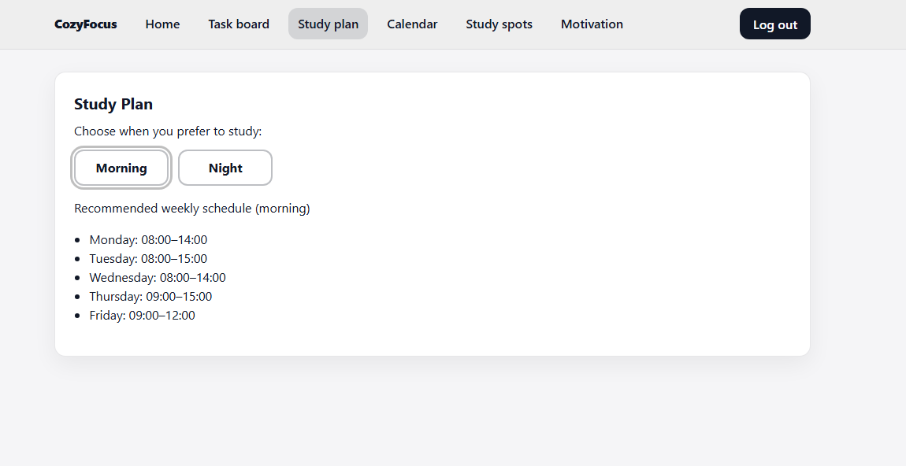
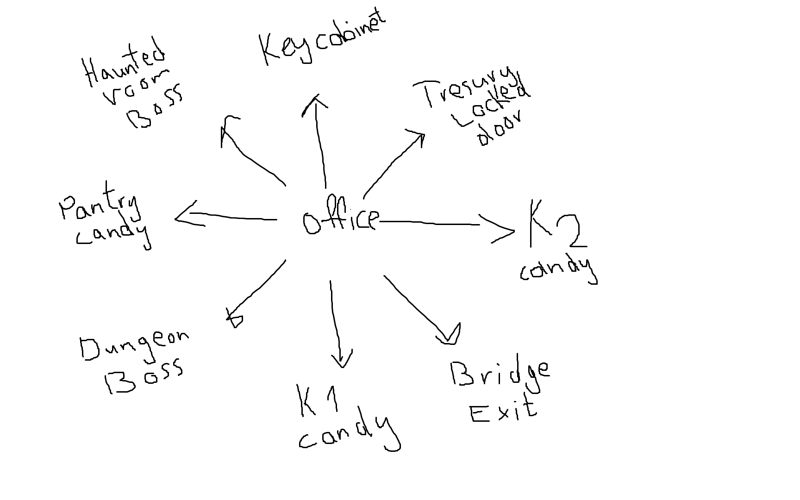

Rita Daloul – E-portfolio

Civilingenjörsstudent i informationsteknik på KTH med intresse för frontend-utveckling och moderna webbapplikationer.

---

Kontakt:
Email: ritadaloul2004.d@gmail.com
LinkedIn: [https://www.linkedin.com/in/rita-daloul-5152722b3](https://www.linkedin.com/in/rita-daloul-5152722b3/)    

---

Projekt

###CozyFocus – Studieplaneringswebb

CozyFocus är en webbaserad studie- och produktivitetsapp utvecklad i React. Projektet skapades för att hjälpa studenter att planera uppgifter, strukturera veckan och samla flera studieverktyg i ett gränssnitt.
Projektet genomfördes inom kursen Interaction Programming and the Dynamic Web.

Funktioner
- Uppgiftshantering med prioritering
- Veckoplanering
- Google Calendar-integration
- Studieplats-sökning via Mapbox
- Motivationschatt via OpenAI
- Firebase-autentisering med användarspecifik lagring

Teknik
- React (Vite)
- JavaScript (ES6+)
- Firebase (Authentication & Firestore)
- Google Calendar API
- Mapbox API
- OpenAI API
- Git (versionshantering och kodgranskning)

Min roll
- Utvecklade komponentbaserad frontend
- Implementerade API-integrationer
- Deltog i kodgranskning och gemensam versionshantering
- Testning och felsökning

### Exempel från projektet

Login Page:


Home Page:


Task Board:


Study Plan:


Calendar for upcoming events: 


Study Spots nearby:


Study motivational Coach:


### Teknisk inblick
Hela projektkoden är inte publik eftersom projektet är kopplat till kursmoment. Därför visar jag här utvalda kodutdrag och screenshots som demonstrerar en del av mitt arbete.
Kodexemplen nedan fokuserar på Google Calendar och React-logik som exempel på mitt arbete i projektet. Utöver detta implementerade jag även funktioner med Mapbox och OpenAI i andra delar av applikationen.

#### 1. Google Calendar – hämta kommande events
Det här kodexemplet visar hur jag hämtade användarens kommande kalenderhändelser via Google Calendar API med OAuth-token och omvandlade svaret till ett format som appen kan använda.
```js
const GCAL_BASE_URL = "https://www.googleapis.com/calendar/v3/calendars";
export function fetchUpcomingEvents(options = {}, accessToken, calendarId = "primary") {
  if (!accessToken) throw new Error("Missing OAuth access token");
  const maxResults = options.maxResults || 20;
  const nowISO = new Date().toISOString();
  const params = new URLSearchParams({
    timeMin: nowISO,
    singleEvents: "true",
    orderBy: "startTime",
    maxResults: String(maxResults),
  }).toString();
  const url = `${GCAL_BASE_URL}/${encodeURIComponent(calendarId)}/events?${params}`;
  return fetch(url, {
    headers: { Authorization: "Bearer " + accessToken },
  })
    .then((response) => {
      if (!response.ok) throw new Error("Calendar fetch failed: " + response.status);
      return response.json();
    })
    .then((data) =>
      (data.items || []).map((ev) => ({
        id: ev.id,
        summary: ev.summary || "(no title)",
        description: ev.description || "",
        start: ev.start,
        end: ev.end,
      }))
    );
}
```
Detta visar att jag arbetade med autentisering, API-anrop, felhantering och datarensning innan informationen skickades vidare till gränssnittet.

#### 2. Google Calendar – skapa study block
Det här kodexemplet visar hur användaren kan skapa ett nytt studiepass direkt i sin Google Calendar från appen.

```js
export function createStudyBlock(eventData, accessToken, calendarId = "primary") {
  if (!accessToken) throw new Error("Missing OAuth access token");
  if (!eventData?.summary || !eventData?.startDateTime || !eventData?.endDateTime) {
    throw new Error("createStudyBlock: summary, startDateTime, endDateTime required");
  }
  const url = `${GCAL_BASE_URL}/${encodeURIComponent(calendarId)}/events`;
  const body = {
    summary: eventData.summary,
    description: eventData.description || "",
    start: { dateTime: eventData.startDateTime },
    end: { dateTime: eventData.endDateTime },
  };
  return fetch(url, {
    method: "POST",
    headers: {
      "Content-Type": "application/json",
      Authorization: "Bearer " + accessToken,
    },
    body: JSON.stringify(body),
  })
    .then((response) => {
      if (!response.ok) {
        return response.text().then((text) => {
          throw new Error("Calendar create failed (" + response.status + "): " + text);
        });
      }
      return response.json();
    })
    .then((created) => ({
      id: created.id,
      htmlLink: created.htmlLink,
      summary: created.summary,
    }));
}
```
Detta visar att jag byggde funktionalitet där användaren inte bara läser data, utan också skapar nya kalenderhändelser genom appen.

#### 3. React-logik – koppling mellan model och view
Det här kodexemplet visar hur jag kopplade användarinteraktion i gränssnittet till logiken för att ladda kalenderdata och skapa study blocks.

```js
export const CalendarPresenter = observer(function CalendarPresenter({ model }) {
  const ps = model.model.calenderPromiseState;
  const cps = model.model.createStudyBlockPromiseState;
  function reloadACB() {
    model.loadCalenderEvents(true);
  }
  function createStudyBlockACB({ title, startLocal, durationMinutes }) {
    const start = new Date(startLocal);
    const end = new Date(start.getTime() + Number(durationMinutes) * 60 * 1000);
    model.createCalendarStudyBlock({
      summary: (title || "").trim() || "Study session",
      startDateTime: start.toISOString(),
      endDateTime: end.toISOString(),
      description: "Created from CozyFocus",
    });
  }
  useEffect(() => {
    if (!ps.promise && !ps.data && !ps.error) model.loadCalenderEvents(false);
  }, []);

  return (
    <CalendarView
      loading={!!ps.promise && !ps.data && !ps.error}
      error={ps.error ? String(ps.error) : ""}
      events={ps.data || []}
      onReload={reloadACB}
      onCreateStudyBlock={createStudyBlockACB}
      creating={!!cps.promise && !cps.data && !cps.error}
      createError={cps.error ? String(cps.error) : ""}
    />
  );
});
```
Detta visar hur jag arbetade med React, MobX och presenter/view-struktur för att hantera laddningstillstånd, fel och användarinteraktion på ett tydligt sätt.

### Utmaningar och lärdomar
En av de viktigaste delarna i projektet var att koppla ihop flera externa tjänster i ett sammanhängande användarflöde. Jag lärde mig att arbeta med OAuth, hantera asynkrona API-anrop, rensa och strukturera data samt koppla detta till ett tydligt React-gränssnitt.

---

##Interactive Game – Kursen Datorteknik (Dtek-V board)
Interactive Game är ett miniprojekt utvecklat i C för Dtek-V board inom kursen Datorteknik. Projektet byggdes som ett hårdvarunära spel där indata från knappar och switchar kopplades till spelbeteende och visuell återkoppling via LEDs och HEX-display.


Teknik
- C
- Dtek-V board
- Lågnivåprogrammering
- I/O-enheter (knappar, timer, switchar, LEDs och HEX-display)

Min roll
- Implementerade spellogik
- Felsökning av hårdvara och mjukvara
- Strukturerad problemlösning

### Exempel från projektet

Skiss över spelvärlden med rum, nycklar, godis, bossar och utgång.


### Teknisk inblick

Hela projektk är inte publik eftersom projektet är kopplat till kursmoment. Därför visar jag här utvalda kodutdrag som demonstrerar delar av mitt arbete.

#### 1. Input från knappar och switchar
Det här kodexemplet visar hur jag hanterade knapptryckningar och switchar med edge detection för att undvika upprepade triggers när en knapp eller switch hålls inne.

```c
int pressed_button(void){
    static unsigned last = 0;
    unsigned now = BTN1REG & 1u;
    int edge = (now == 1 && last == 0);
    last = now;
    return edge;
}

int reset_pressed(void){
    static unsigned last_sw = 0;
    unsigned sw = SWITCHES & 0x3FFu; 
    int edge = ((sw & (1u<<7)) && !(last_sw & (1u<<7))); 
    last_sw = sw;
    return edge;
}

unsigned get_switch_rise(void){
    static unsigned last = 0;
    unsigned sw   = SWITCHES & 0x3FFu;   
    unsigned rise = sw & ~last;          
    last = sw;
    return rise;
}
```
Detta visar hur jag arbetade med hårdvarunära input och gjorde spelinteraktionen mer stabil och kontrollerad.

#### 2. Visning av spelstatus
Det här kodexemplet visar hur jag använde LEDs och HEX-display för att visa spelarens status, till exempel liv och antal drag.

```c
void update_leds(int v)
{
    if (v < 0) v = 0;
    if (v > 10) v = 10;
    unsigned mask = 0;
    for (int i = 0; i < v && i < 10; ++i) 
        mask |= (1u << i);
    LEDS = mask;
}

void update_display(int moves){
    if (moves < 0) 
        moves = 0;
    int ones = moves % 10;
    int tens = (moves/10) % 10;
    hex_write(0, SEG[ones]);  
    hex_write(1, SEG[tens]);  
}
```

Detta visar hur jag kopplade spelets logik till fysisk output på kortet och arbetade med visualisering av spelstatus i en inbyggd miljö.

### Utmaningar och lärdomar
En viktig del av projektet var att få mjukvara och hårdvara att samverka på ett stabilt sätt. Jag lärde mig att arbeta med memory-mapped I/O, felsöka låg nivå-kod och strukturera input- och outputhantering i C.
