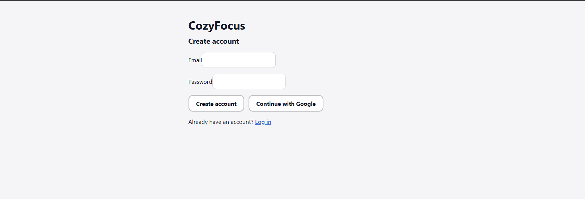
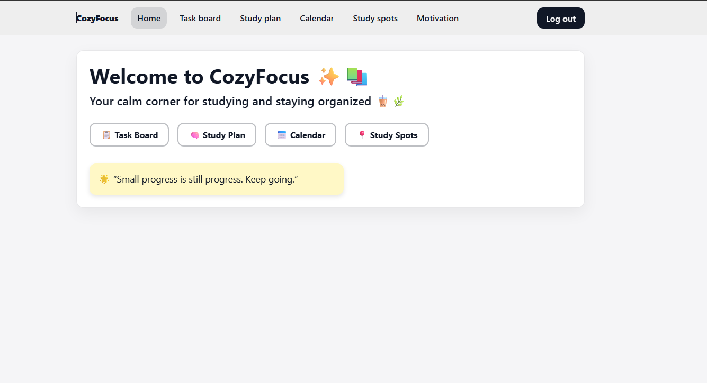
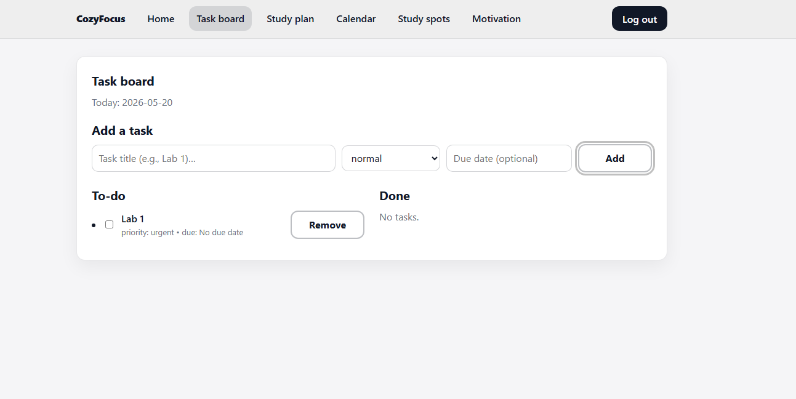
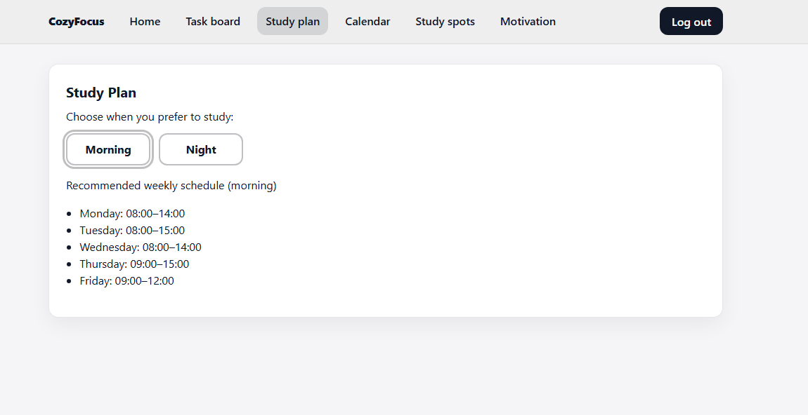
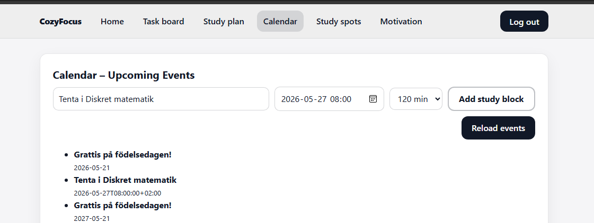
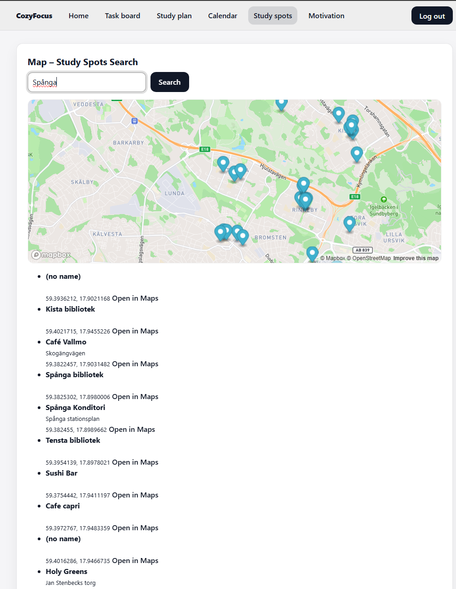
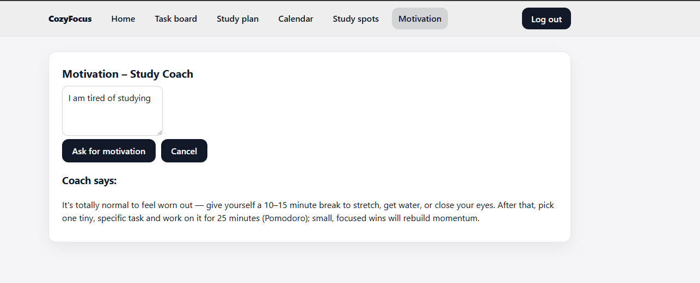
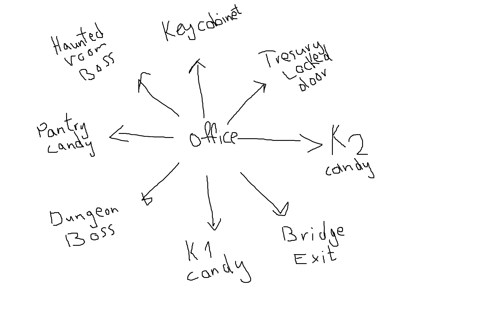

# Rita Daloul – Portfolio

Civil Engineering student in Information Technology at KTH Royal Institute of Technology in Stockholm, Sweden, with an interest in software development, web applications, APIs and technical problem-solving.

This repository showcases selected university projects and technical work.

---

## 🚀 Projects

### CozyFocus – Study Planning Web Application

CozyFocus is a web-based study and productivity application developed in React. The application helps students manage tasks, plan their week and access several study-related tools in one interface.

The project was developed as part of the course *Interaction Programming and the Dynamic Web* at KTH.

#### Features

- Task management with prioritisation
- Weekly planning
- Google Calendar integration
- Study spot search using Mapbox
- AI-powered study motivation using OpenAI
- Firebase authentication and user-specific data storage

#### Technologies

- React
- JavaScript (ES6+)
- Vite
- Firebase Authentication & Firestore
- Google Calendar API
- Mapbox API
- OpenAI API
- Git

#### My Contributions

- Developed component-based React frontend
- Implemented API integrations
- Worked with authentication and user-specific data
- Implemented Google Calendar functionality
- Participated in code reviews and Git-based collaboration
- Tested and debugged application functionality

### Screenshots

Login Page:


Home Page:


Task Board:


Study Plan:


Calendar for upcoming events: 


Study Spots nearby:


Study motivational Coach:


---

### Technical Highlights

The complete CozyFocus source code is not public because the project was developed as part of a university course. The examples below demonstrate selected parts of my implementation.

#### Google Calendar – Fetch upcoming events

This example shows how I retrieved upcoming calendar events through the Google Calendar API using an OAuth access token, handled API errors and transformed the response into data used by the application.

```js
const GCAL_BASE_URL = "https://www.googleapis.com/calendar/v3/calendars";
export function fetchUpcomingEvents(options = {}, accessToken, calendarId = "primary") {
  if (!accessToken) throw new Error("Missing OAuth access token");
  const maxResults = options.maxResults || 20;
  const nowISO = new Date().toISOString();
  const params = new URLSearchParams({
    timeMin: nowISO,
    singleEvents: "true",
    orderBy: "startTime",
    maxResults: String(maxResults),
  }).toString();
  const url = `${GCAL_BASE_URL}/${encodeURIComponent(calendarId)}/events?${params}`;
  return fetch(url, {
    headers: { Authorization: "Bearer " + accessToken },
  })
    .then((response) => {
      if (!response.ok) throw new Error("Calendar fetch failed: " + response.status);
      return response.json();
    })
    .then((data) =>
      (data.items || []).map((ev) => ({
        id: ev.id,
        summary: ev.summary || "(no title)",
        description: ev.description || "",
        start: ev.start,
        end: ev.end,
      }))
    );
}
```
This demonstrates API communication, OAuth authentication, error handling and data transformation.

####  Google Calendar – Create study blocks

The application also allows users to create study sessions directly in their Google Calendar.

```js
export function createStudyBlock(eventData, accessToken, calendarId = "primary") {
  if (!accessToken) throw new Error("Missing OAuth access token");
  if (!eventData?.summary || !eventData?.startDateTime || !eventData?.endDateTime) {
    throw new Error("createStudyBlock: summary, startDateTime, endDateTime required");
  }
  const url = `${GCAL_BASE_URL}/${encodeURIComponent(calendarId)}/events`;
  const body = {
    summary: eventData.summary,
    description: eventData.description || "",
    start: { dateTime: eventData.startDateTime },
    end: { dateTime: eventData.endDateTime },
  };
  return fetch(url, {
    method: "POST",
    headers: {
      "Content-Type": "application/json",
      Authorization: "Bearer " + accessToken,
    },
    body: JSON.stringify(body),
  })
    .then((response) => {
      if (!response.ok) {
        return response.text().then((text) => {
          throw new Error("Calendar create failed (" + response.status + "): " + text);
        });
      }
      return response.json();
    })
    .then((created) => ({
      id: created.id,
      htmlLink: created.htmlLink,
      summary: created.summary,
    }));
}
```
This demonstrates authenticated API requests, request validation, error handling and creating data through an external API.

#### React – Calendar presentation logic

This example shows how React, MobX and the application model were connected to handle loading states, errors and user interactions.

```js
export const CalendarPresenter = observer(function CalendarPresenter({ model }) {
  const ps = model.model.calenderPromiseState;
  const cps = model.model.createStudyBlockPromiseState;
  function reloadACB() {
    model.loadCalenderEvents(true);
  }
  function createStudyBlockACB({ title, startLocal, durationMinutes }) {
    const start = new Date(startLocal);
    const end = new Date(start.getTime() + Number(durationMinutes) * 60 * 1000);
    model.createCalendarStudyBlock({
      summary: (title || "").trim() || "Study session",
      startDateTime: start.toISOString(),
      endDateTime: end.toISOString(),
      description: "Created from CozyFocus",
    });
  }
  useEffect(() => {
    if (!ps.promise && !ps.data && !ps.error) model.loadCalenderEvents(false);
  }, []);

  return (
    <CalendarView
      loading={!!ps.promise && !ps.data && !ps.error}
      error={ps.error ? String(ps.error) : ""}
      events={ps.data || []}
      onReload={reloadACB}
      onCreateStudyBlock={createStudyBlockACB}
      creating={!!cps.promise && !cps.data && !cps.error}
      createError={cps.error ? String(cps.error) : ""}
    />
  );
});
```
This demonstrates React component logic, MobX state handling, asynchronous operations, loading states and error handling.


### Key Technical Experience

Through CozyFocus, I gained practical experience with:

- REST API integration
- OAuth-based authentication
- Asynchronous JavaScript
- Error handling
- Data transformation
- React component architecture
- MobX
- Firebase
- Third-party APIs
- Git-based collaboration

---

### 🎮 Interactive Game – Embedded Systems

Interactive Game is a hardware-oriented game developed in C for the Dtek-V board as part of a computer engineering course at KTH.

The project connected physical inputs such as buttons and switches to game logic and provided visual feedback through LEDs and HEX displays.

#### Technologies
- C
- Dtek-V board
- Embedded systems
- Memory-mapped I/O
- Hardware interaction
- Buttons and switches
- LEDs and HEX displays

#### My Contributions
- Implemented game logic
- Implemented hardware input handling
- Worked with memory-mapped I/O
- Implemented LED and HEX display output
- Debugged hardware and software interaction

### Game Map 

Sketch of the game world showing rooms, keys, treats, bosses, and the exit.


### Technical Highlights

The entire project is not public, as it is linked to specific course components. Therefore, I am presenting selected code snippets here that demonstrate parts of my work.

#### 1. Button and switch input
The following example uses edge detection to detect button and switch state changes rather than continuously triggering while an input is held.

```c
int pressed_button(void){
    static unsigned last = 0;
    unsigned now = BTN1REG & 1u;
    int edge = (now == 1 && last == 0);
    last = now;
    return edge;
}

int reset_pressed(void){
    static unsigned last_sw = 0;
    unsigned sw = SWITCHES & 0x3FFu; 
    int edge = ((sw & (1u<<7)) && !(last_sw & (1u<<7))); 
    last_sw = sw;
    return edge;
}

unsigned get_switch_rise(void){
    static unsigned last = 0;
    unsigned sw   = SWITCHES & 0x3FFu;   
    unsigned rise = sw & ~last;          
    last = sw;
    return rise;
}
```
This demonstrates low-level input handling and edge detection for embedded hardware.

#### 2. LED and HEX display output
The game used LEDs and HEX displays to provide visual feedback such as player status and number of moves.

```c
void update_leds(int v)
{
    if (v < 0) v = 0;
    if (v > 10) v = 10;
    unsigned mask = 0;
    for (int i = 0; i < v && i < 10; ++i) 
        mask |= (1u << i);
    LEDS = mask;
}

void update_display(int moves){
    if (moves < 0) 
        moves = 0;
    int ones = moves % 10;
    int tens = (moves/10) % 10;
    hex_write(0, SEG[ones]);  
    hex_write(1, SEG[tens]);  
}
```

This demonstrates how software logic was connected to physical output devices on the board.

### What I Learned
This project gave me practical experience with:

- Low-level C programming
- Memory-mapped I/O
- Embedded systems
- Hardware interaction
- Input and output handling
- Debugging software and hardware interaction

### 🚌 SL Table – Web-Based Public Transport Application
SL Table was a group project developed at KTH as part of a web development course.

The project involved developing a web-based public transport application and coordinating different parts of the system as a group.

### My Contributions
- Contributed to backend development
- Worked with integration between different parts of the application
- Collaborated with other students throughout the development process
